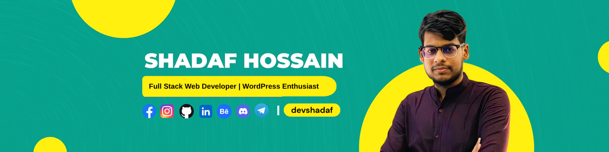

## ​🙎🏻​ About Me 
<h3 align="center">
  Hey, I’m Shadaf!  
   
</h3>

<h3 align="center">
  A passionate developer turning ideas into code, one line at a time 🎯🚀 
</h3>

<h4 align="center">
    👨‍💻 Programmer &nbsp;|&nbsp; 🌐 Full Stack Web Developer &nbsp;|&nbsp; 🎨 WordPress Enthusiast
</h4>

   
 

## :eyes: Current overview

<h3> 🔭 I’m currently exploring better opportunities where I can learn, grow & contribute </h3>
<h3> 👯 Open to collaborating on exciting open-source projects and innovative ideas </h3>
<h3> 💬 Passionate about Web Development & Programming  </h3>
<h3> 🎯 To build real-world projects that combine creativity with performance  </h3>
<h3> 👨‍💻 Check out my work & Projects here 👉 <a href="https://www.behance.net/shadafhossain01/">Behance Portfolio</a> </h3>
<h3> 🌐 Let’s connect on <a href="https://www.linkedin.com/in/shadafhossain01/">LinkedIn</a> </h3>

 

## 👨🏽‍💻 My Skill Set  
<table>
  <tr>
    <td valign="top" width="33.33%">

### 💻 Frontend  
  

</td>
<td valign="top" width="33.33%">

### ⚙️ Backend  

</td><td valign="top" width="33.33%">

### 🔗 Others  
 

</td></tr></table>  

  

 
  
## :chart_with_upwards_trend: Current Github Stats

  
  

 

  
  

###

<h2 align="left">  Let's Connect : </h2>

  
  
  
  
  
  

 

	

